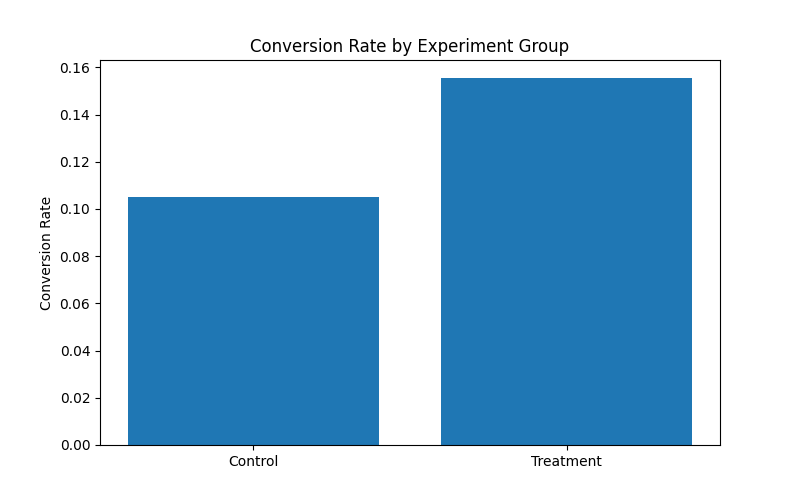
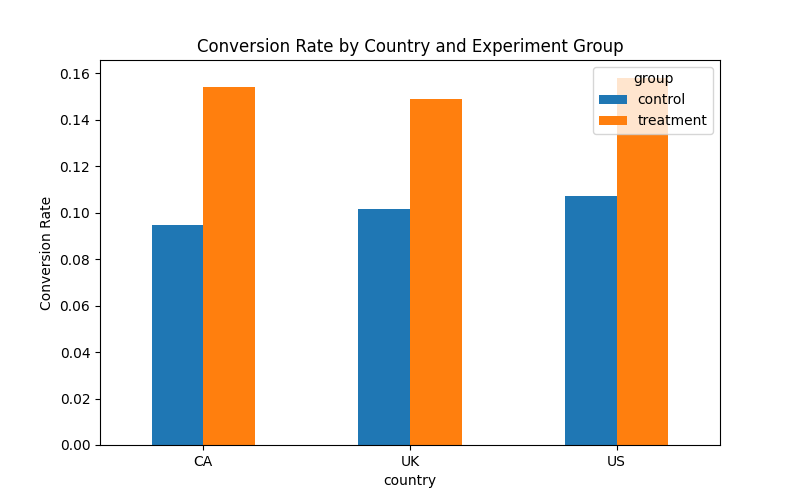
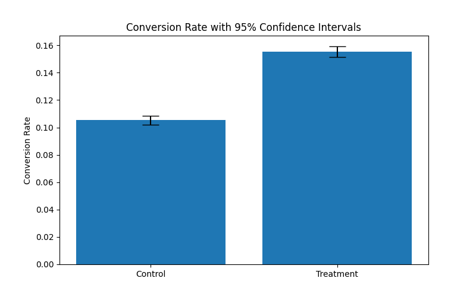

# A/B Testing Conversion Optimization

## Executive Summary

In this project I analyze an A/B test to evaluate whether a new product experience improves user conversion rates.

The treatment group achieved a **15.53%** conversion rate compared to **10.53%** for the control group. This represents an **absolute increase of 5.01 percentage points** (about a **47.6% relative improvement**).

A two-proportion Z-test shows that this difference is **statistically significant**, meaning the improvement is very unlikely to be caused by random variation. Power analysis also confirms that the experiment had more than enough data to detect the observed effect.

The treatment outperformed the control across all geographic segments (**US, UK, and Canada**), which suggests the improvement is consistent rather than isolated to one region.

If this change were rolled out to roughly **70,000 users**, it could generate around **3,500 additional conversions**.

**Conclusion:** the experiment results support deploying the treatment version.

---

## Project Overview

A product team introduced a redesigned webpage aimed at improving conversion rates. The goal of this analysis is to determine whether the new version actually improves performance compared to the existing experience.

Using a standard A/B testing workflow, this project:

- compares conversion rates between control and treatment groups
- evaluates statistical significance
- estimates uncertainty using confidence intervals
- checks whether the experiment had enough data to detect the effect
- examines whether the results are consistent across different countries
- translates the experiment results into potential business impact

---

## Why This Project Matters

A/B testing is one of the core tools used by product and growth teams. In practice, teams don't just ask whether a metric changed — they want to know:

- Is the change statistically reliable?
- Is the improvement meaningful from a business perspective?
- Does the effect hold across different user segments?

This project walks through that full workflow and demonstrates how experiment results can be turned into a data-driven product decision.

---

## Dataset

The dataset contains user-level observations from the experiment with the following fields:

- **country** – the user’s geographic region  
- **group** – whether the user was assigned to the control or treatment experience  
- **converted** – whether the user completed the conversion event (0 or 1)

**Total observations:**  
**69,889 users**

Country distribution:

- United States ≈ 70%
- United Kingdom ≈ 25%
- Canada ≈ 5%

---

## Methodology

The experiment analysis follows a standard experimentation workflow.

### 1. Data validation

Before running any analysis, the dataset is checked for:

- correct structure and data types
- missing values
- balanced assignment between control and treatment groups

### 2. Conversion rate analysis

Conversion rates are calculated for both groups and compared to estimate:

- absolute uplift
- relative improvement

### 3. Hypothesis testing

A **two-proportion Z-test** is used to determine whether the observed difference between groups is statistically significant.

### 4. Confidence intervals

95% confidence intervals are computed to quantify the uncertainty around the conversion estimates.

### 5. Power analysis

Power analysis is performed to confirm that the experiment had a large enough sample size to detect the observed effect.

### 6. Segment analysis

Conversion performance is analyzed by country to evaluate whether the treatment effect is consistent across geographic segments.

### 7. Business impact estimation

The observed uplift is translated into expected additional conversions if the treatment were deployed.

---

## Key Results

| Metric | Control | Treatment |
|------|------|------|
| Conversion Rate | **10.53%** | **15.53%** |

**Absolute uplift:**  
+ **5.01 percentage points**

**Relative uplift:**  
+ **47.6% improvement**

The difference between groups is **statistically significant**, indicating that the improvement is unlikely to be due to random variation.

---

## Business Impact

If the treatment experience were deployed to a population of about **70,000 users**, the expected outcome would be approximately:

**≈ 3,500 additional conversions**

Because the uplift appears across all geographic segments, the improvement is likely to generalize beyond a single region.

---

## Visualizations

### Conversion Rate Comparison



### Conversion Rate by Country



### Conversion Rate with 95% Confidence Intervals



---

## Recommendation

Based on the statistical results and the estimated business impact, the treatment version clearly improves conversion performance.

The analysis supports **rolling out the treatment experience globally**.

---

## Technologies Used

- Python
- Pandas
- NumPy
- Matplotlib
- Statsmodels
- Jupyter Notebook

---

# Project Structure

```
ab-testing-conversion-experiment
│
├── config
│   └── config.yaml
│
├── data
│   └── ab_data.csv
│
├── notebooks
│   └── experiment_analysis.ipynb
│
├── src
│   ├── experiment_utils.py
│   └── stats_tests.py
│
├── visualizations
│   ├── conversion_rate_comparison.png
│   ├── country_conversion_comparison.png
│   └── conversion_confidence_intervals.png
│
├── README.md
└── requirements.txt
```

---

## Reproducibility

To run this project locally:

1. Clone the repository
2. Install the dependencies
3. Open the notebook and run the analysis

Example setup:

```bash
git clone https://github.com/Balla6/ab-testing-conversion-optimization.git
cd ab-testing-conversion-optimization
pip install -r requirements.txt
```

Reusable statistical functions used in the analysis are located in:

- `src/stats_tests.py`
- `src/experiment_utils.py`

---

## Skills Demonstrated

- A/B experimentation
- Statistical hypothesis testing
- Confidence interval estimation
- Statistical power analysis
- Segment-level analysis
- Business impact estimation
- Data visualization
- Analytical storytelling
